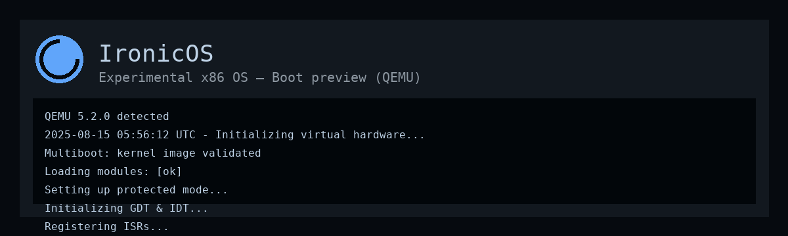

<p align="center">
  
  
</p>

<h1 align="center">🌀 IronicOS</h1>
<p align="center">
  <b>IronicOS</b> is a minimal experimental operating system built from scratch in <b>C</b>, <b>x86 Assembly</b>, and <b>GRUB</b>.  
  Designed for learning systems programming, kernel development, and bootloader fundamentals — all in one project.
</p>

---

## 📸 QEMU Boot Preview

<p align="center">
  
  <br>
  <sub>QEMU showing the kernel message: <i>"Booting IronicOS..."</i></sub>
</p>

---

## 📜 Features
- **Custom 32-bit Protected Mode Kernel**  
- **GRUB Multiboot Compatible Bootloader**  
- **Basic VGA Text Output**  
- **Interrupt Descriptor Table (IDT) Setup**  
- **Interrupt Service Routines (ISRs) & IRQ Handling**  
- **Simple PS/2 Keyboard Input**  
- **Basic Shell Interface**  
- **QEMU Virtual Machine Support**  
- **Continuous Integration with GitHub Actions** (boot log verification)

---

## 🚀 Getting Started

### 📦 Requirements
Make sure you have the following installed:
- **GCC Cross-Compiler** (`i686-elf-gcc`)
- **NASM** assembler
- **GRUB Tools** (`grub-pc-bin`, `xorriso`, `mtools`)
- **Build & Run Tools** (`make`, `qemu-system-i386`)

---

### 🛠️ Installation & Build

```bash
# Clone the repository
git clone https://github.com/IronicYash/IronicOS.git
cd IronicOS

# 1) Install unzip (and a few useful helpers)
sudo apt update
sudo apt install -y unzip wget curl rsync tar ca-certificates

# 2) Re-run the installer you already started
chmod +x installer.sh
./installer.sh

# 3) If installer finished successfully, add toolchain to PATH (if script didn't already)
echo 'export PATH="$HOME/opt/cross/bin:$PATH"' >> ~/.bashrc
source ~/.bashrc

# 4) Verify cross-compiler is available
which i686-elf-gcc && i686-elf-gcc --version
# Build the kernel
make

# Create the bootable ISO
make iso

# Run the OS in QEMU
make run

## 📂 Project Structure

.IronicOS/
├── Makefile                # Main build file (supports make, make iso, make run, make clean)
├── linker.ld                # Linker script for kernel
├── .gitignore               # Ignore build artifacts & temp files
├── .gitattributes           # GitHub syntax highlighting & LF line ending rules
├── .editorconfig            # Editor formatting rules
├── grub/
│   └── grub.cfg             # GRUB boot menu configuration (copied into ISO at build time)
├── build/                   # (Generated) Compiled object files and kernel.elf
├── isodir/                  # (Generated) ISO root directory
│   └── boot/
│       ├── kernel.elf       # Compiled kernel binary
│       └── grub/
│           └── grub.cfg     # GRUB config inside ISO
├── kernel/
│   ├── kernel_main.c        # Kernel entry point (after assembly boot)
│   ├── entry.asm            # Early assembly entry point (sets up stack, jumps to C)
│   └── multiboot_header.asm # Multiboot header for GRUB
├── cpu/
│   ├── idt.c / idt.h        # Interrupt Descriptor Table setup
│   ├── idt_load.asm         # Assembly helper to load IDT
│   ├── isr.c / isr.h        # Interrupt Service Routines (CPU exceptions)
│   ├── isr.asm              # ISR stubs in assembly
│   ├── irq.c / irq.h        # IRQ handlers (hardware interrupts)
│   └── irq.asm              # IRQ stubs in assembly
├── lib/
│   ├── screen.c / screen.h  # VGA text mode output
│   ├── keyboard.c / keyboard.h # PS/2 keyboard input handling
│   ├── string.c / string.h  # Basic string/memory functions
│   ├── timer.c / timer.h    # PIT timer handling
│   └── shell.c / shell.h    # Simple kernel shell
└── memory/                  # (Future) Memory management code
